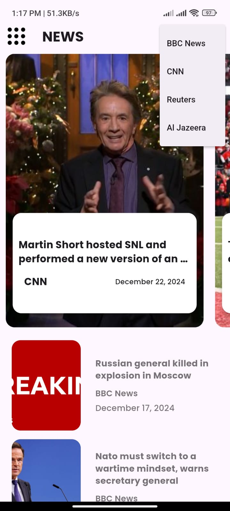

# News App

A dynamic and feature-rich news application built with **Flutter**. This app enables users to stay updated with the latest news across various categories and sources.

## Features

- **Categorized News**: Browse news by categories like Sports, Health, Business, Technology, and more.
- **Search News**: Search for articles using keywords.
- **Filter by Sources**: View news from specific sources or channels.

## Screenshots

| Home Screen | Category Screen | Article Detail |
|-------------|-----------------|----------------|
|  |  |  |

## Technologies Used

- **Flutter**: Cross-platform UI toolkit for building natively compiled applications.
- **Dart**: Programming language for Flutter development.
- **CUBIT**: State management solution.
- **DIO**: For API calls to fetch news data.
- **CachedNetworkImage**: Efficient image loading and caching.

## Installation

1. Clone the repository:

   ```bash
   git clone https://github.com/Elvin5002/news-app.git
   cd news-app
   ```

2. Open the project in your preferred IDE (Android Studio, VS Code, etc.).

3. Install dependencies:
   ```bash
   flutter pub get
   ```

4. Obtain an API key from [NewsAPI](https://newsapi.org/) and add it to your `.env` file in the root directory:
   ```env
   NEWS_API_KEY=your_api_key_here
   ```

5. Run the app on an emulator or a physical device:
   ```bash
   flutter run
   ```

## How to Use

1. Launch the app on your device.
2. Browse the home screen to view top news.
3. Navigate to specific categories using the bottom navigation.
4. Click on an article to view details.
5. Use the bookmark button to save articles for later.
6. Search for news using the search bar.
